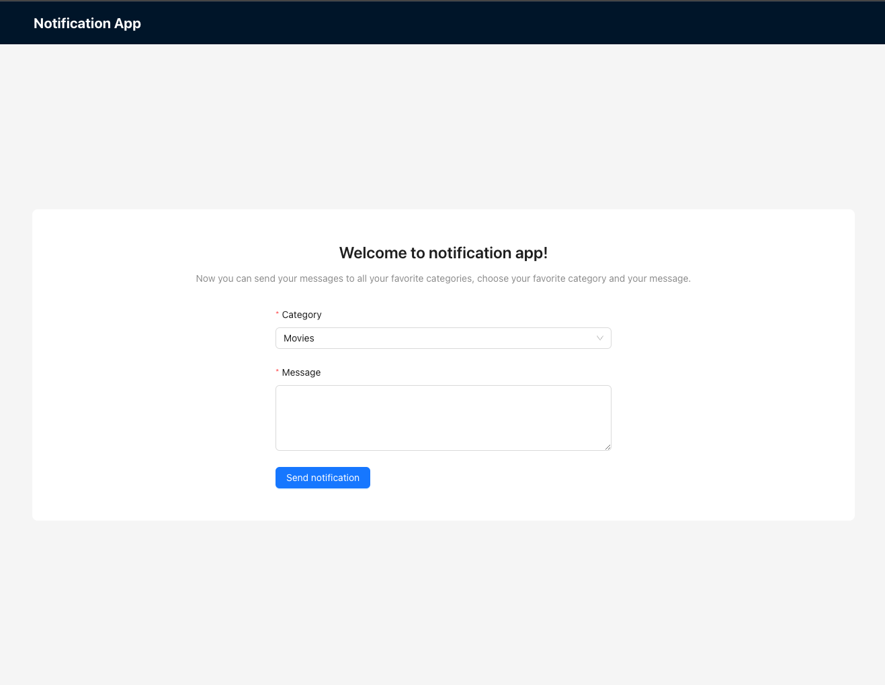

# Getting Started Notification App

Notification app that allows you send notifications according categories.



## Requirements

- Docker v25 or higher
- NodeJS v18 or higher
- NPM v7 or higher

## First steps

- Back-end:
  1. Go to `./backend` folder.
  2. Create your `.env` file at `backend` root directory. Take as example `.env.example` file at `backend` root directory.
  3. Run the following command, this command will fill the DB with all data needed for this project.

  ```bash
  npm run fill-db
  ```

  4. Once the DB is filled, run the following command to start the backend, the backend will run in <http://localhost:4000>

  ```bash
  docker-compose up --build
  ```

- Front-end:
  1. Go to `./frontend` folder
  2. Create your `.env` file at `frontend` root directory. Take as example `.env.example` file at `frontend` root directory.
  3. Run the folloing command to install all dependecies.
  
  ```bash
  npm run fill-db
  ```
  
  4. Run the following command to run the project in browser. Open <http://localhost:3000> to view it in the browser.

  ```bash
  npm start
  ```

## Folder structure

### Back-end

```text
backend/
├── node_modules/
├── scripts/
|   ├── fillDB.ts
│   └── mocks/
│       └── database.ts
├── src/
│   ├── agents/
│   │   └── notifications/
│   │       ├── Email.ts
│   │       ├── index.ts
│   │       ├── notificationAgent.ts
│   │       ├── PushNotification.ts
│   │       └── SMS.ts
│   ├── constants/
│   │   └── index.ts
│   ├── GQL/
│   │   ├── MessageCategory.gql
│   │   ├── NotificationLog.gql
│   │   ├── NotificationType.gql
│   │   └── User.gql
│   ├── models/
│   │   ├── index.ts
│   │   ├── MessageCategory.test.ts
│   │   ├── MessageCategory.ts
│   │   ├── NotificationLog.test.ts
│   │   ├── NotificationLog.ts
│   │   ├── NotificationType.test.ts
│   │   ├── NotificationType.ts
│   │   └── User.ts
│   ├── resolvers/
│   │   ├── index.ts
│   │   ├── messageCategoryResolver.ts
│   │   └── notificationLogResolver.ts
│   ├── services/
│   │   └── notifications.ts
│   ├── types/
│   │   └── index.ts
│   └── utils/
│       └── database.ts    
├── jest.config.js
├── .dockerignore
├── package-lock.json
├── .env
├── docker-compose.yml
├── .gitignore
├── package.json
├── Dockerfile
├── README.md
└── tsconfig.json
```

### Front-end

```text
frontend/
├── node_modules/
├── public/
├── src/
│   ├── components/
│   │   ├── Forms/
│   │   │   └── NotificationForm/
│   │   │       ├── index.tsx
│   │   │       ├── NotificationForm.style.css
│   │   ├── Header/
│   │   │   ├── index.tsx
│   │   │   ├── Header.style.css
│   │   ├── NotificationsSection/
│   │       ├── index.tsx
│   │       ├── NotificationsSection.style.css
│   ├── gpl/
│   │   ├── mutations.ts
│   │   ├── queries.ts
│   ├── hooks/
│   │   ├── useCategories.ts
│   │   ├── useNotification.ts
│   ├── types/
│   │   ├── index.ts
│   ├── utils/
│   │   ├── strings.ts
│   ├── App.style.css
│   ├── App.tsx
│   ├── index.css
│   ├── index.tsx
│   ├── react-app-env.d.ts
│   ├── reportWebVitals.ts
│   ├── setupTests.ts
├── .env.example
├── .gitignore
├── package-lock.json
├── package.json
├── README.md
├── tsconfig.json
```
